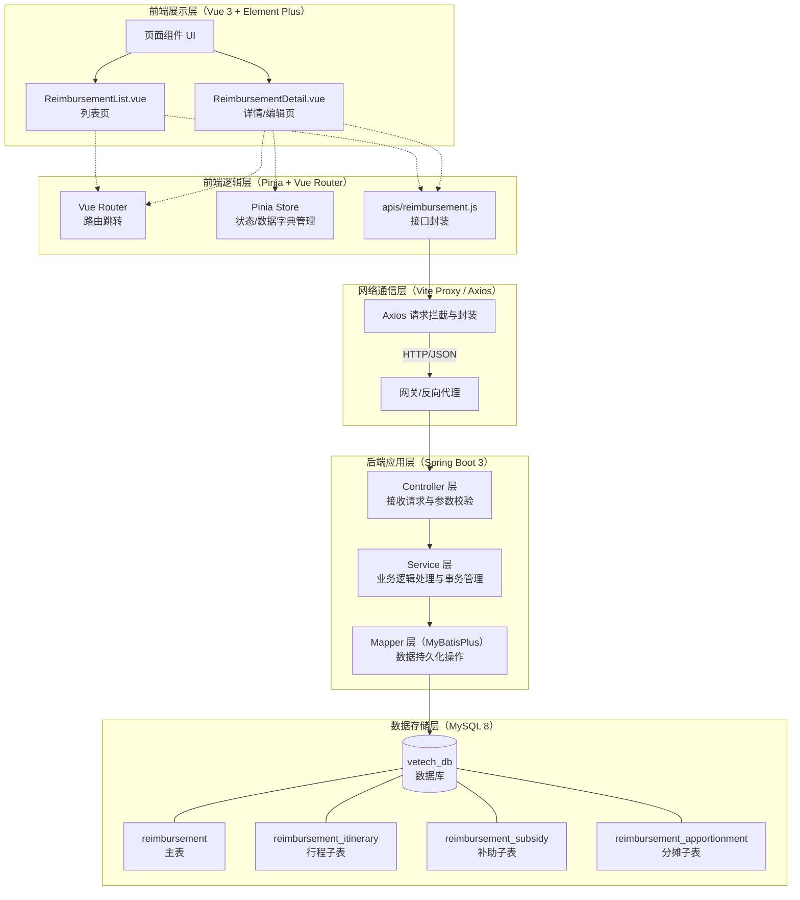
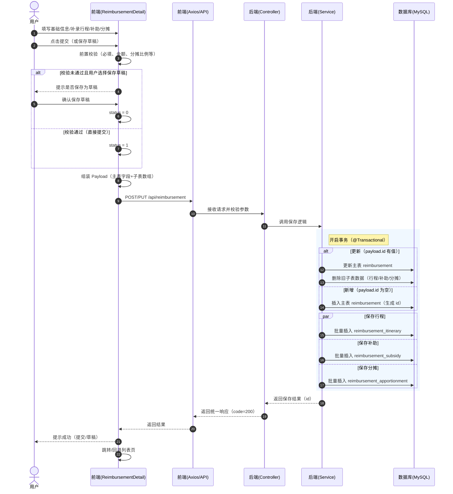
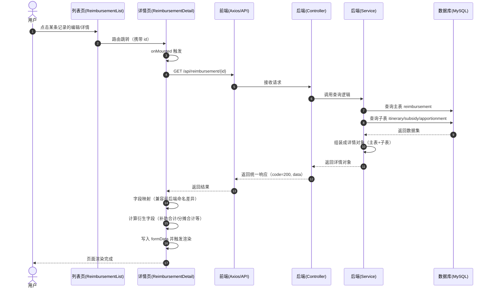

# 报销单管理系统架构与时序图

本文档使用 Mermaid 语法绘制了当前报销单管理系统的整体架构框架图以及核心业务（如提交报销单）的时序图。

---

## 1. 系统架构框架图

本系统采用前后端分离的架构设计。前端基于 Vue 3 体系，后端基于 Spring Boot 3 + MyBatisPlus，数据库使用 MySQL。



---

## 2. 核心业务时序图

### 2.1 新增/编辑并提交报销单时序图

该时序图展示了用户在详情页填写完所有信息后，点击“提交”按钮，前后端交互并最终落库的完整流程。



### 2.2 查看报销单详情时序图

该时序图展示了用户从列表页点击进入详情页时，前端如何通过 ID 获取并回显复杂数据的过程。



---

## 3. 业务流程图

### 3.1 报销单全流程（列表→详情→保存/提交→返回）

```mermaid
flowchart TD
    Entry[进入系统] --> ListPage[报销单列表页<br/>ReimbursementList.vue]
    ListPage -->|刷新/查询| ListApi[GET /api/reimbursement/list]
    ListApi --> ListPage

    ListPage -->|新增| NewDetail[详情页（新增）<br/>ReimbursementDetail.vue]
    ListPage -->|编辑/详情| OpenDetail[详情页（回显）<br/>ReimbursementDetail.vue]
    OpenDetail --> DetailApi[GET /api/reimbursement/{id}]
    DetailApi --> OpenDetail

    ListPage -->|删除| DeleteApi[DELETE /api/reimbursement/{id}]
    DeleteApi --> ListPage

    subgraph DetailFlow[详情页编辑流程]
        Base[填写基础信息] --> Trip[补录行程]
        Trip --> Subsidy[补助信息（按天勾选/录入）]
        Subsidy --> Apportion[费用归属及分摊]
        Apportion --> Validate{前置校验}
        Validate -->|校验通过| Submit[提交<br/>status=1]
        Validate -->|校验未通过| AskDraft{是否保存草稿}
        AskDraft -->|是| Draft[保存草稿<br/>status=0]
        AskDraft -->|否| Fix[返回修改必填项/比例/金额]
        Fix --> Base
    end

    NewDetail --> Base
    OpenDetail --> Base

    Submit --> SaveApi[POST/PUT /api/reimbursement]
    Draft --> SaveApi
    SaveApi --> Back[返回列表页]
    Back --> ListPage
```
