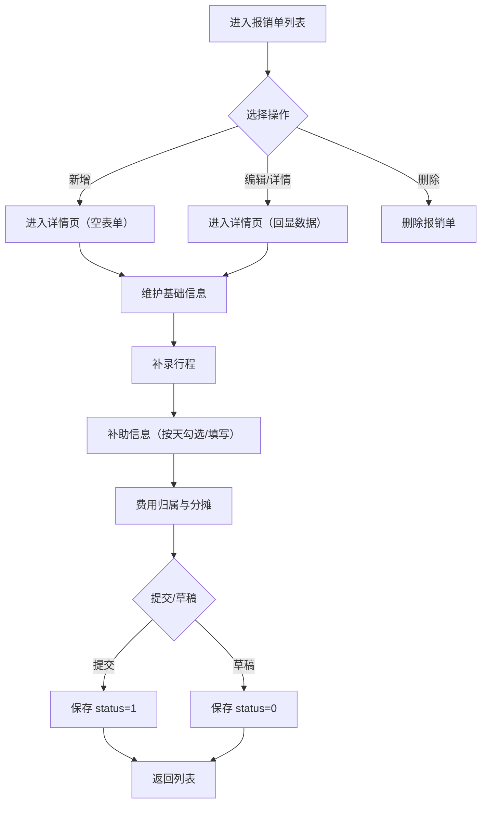
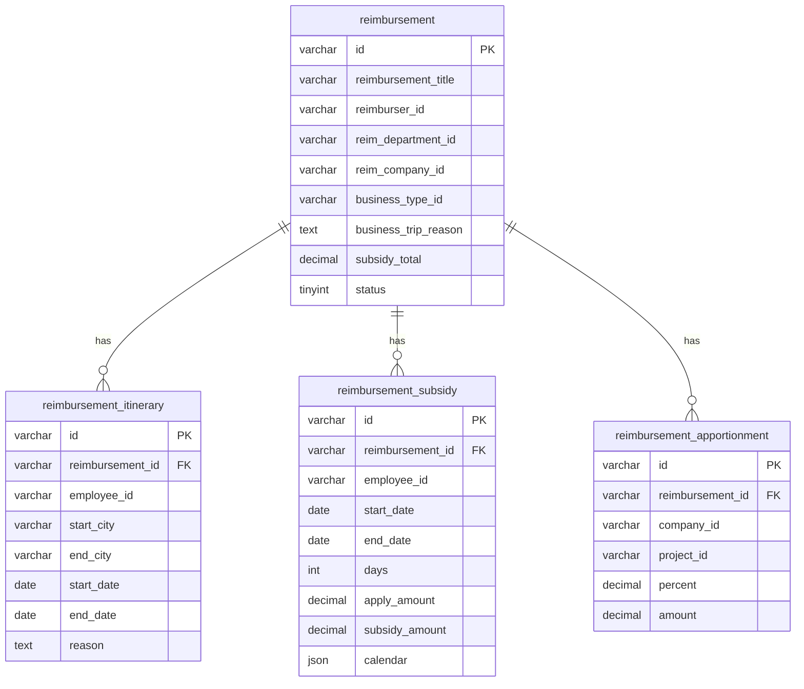
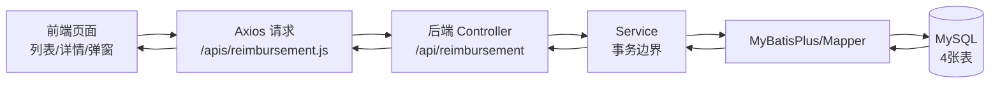

# 详细设计规范（报销单管理模块）

文件状态：草稿 / 修改 / 正式发布（当前：草稿）

所属项目编号：项目立项编号（待填写）  
版    本：1.0  
撰 写 人：（待填写）  
完成日期：2026-05-25  
发布日期：2026-05-25  

| 序号 | 类别 | 版本 | 作者 | 时间 | 备注 |
| :--- | :--- | :--- | :--- | :--- | :--- |
| 1 | 新增 | 1.0 |  | 2026-05-25 | 新增 |

## 目录

| 目录 | 页码 |
| :--- | :--- |
| 开发须知 |  |
| 1. 非功能性要求 |  |
| 2. 详细设计评审要求 |  |
| 3. 术语定义 |  |
| 4. 功能性需求描述 |  |
| 5. 功能详细设计 |  |
| 6. 技术实现设计 |  |
| 7. 关键技术点 |  |
| 8. 数据库设计 |  |
| 9. WBS |  |
| 附录1 接口定义明细 |  |
| 附录2 图表源码（Mermaid） |  |

## 开发须知

详细设计是在充分理解需求的基础上，编写可指导实现与评审的设计文档。本模块详细设计覆盖：
- 报销单列表查询与操作
- 报销单详情编辑、提交/保存草稿
- 补录行程维护
- 补助信息计算与明细维护
- 费用归属与分摊维护

## 1. 非功能性要求

### 可靠性

- 保存/更新/删除报销单时，主表与子表（行程/补助/分摊）需保持一致性：任何一步失败应回滚。
- 前端对关键输入进行健壮性校验：必填、金额区间、比例合计等，非法输入不能导致页面崩溃。

### 高性能

- 列表查询采用后端分页时，要求常用查询在一般网络环境下可快速返回。
- 详情查询需一次返回主表+子表，避免多次往返请求导致延迟叠加。

### 可维护性

- 前端页面逻辑按“页面组件 + API 封装 + 公共请求工具 + Pinia 字典”分层，避免组件直接散落请求细节。
- 后端采用 Controller/Service/Mapper 分层，事务边界在 Service 层统一管理。

### 安全性

- 不在前端/后端日志输出敏感信息。
- 请求入参必须为 JSON，避免拼接 SQL；持久化由 MyBatisPlus 统一处理。

## 2. 详细设计评审要求

- 关键业务流程是否完整：保存/更新/删除的主子表一致性策略是否明确。
- 与页面交互是否对应：字段映射、补助与分摊计算规则是否清晰。
- 异常处理策略是否可落地：校验失败、事务失败、接口失败的用户提示与回退路径。

## 3. 术语定义

| 缩写 | 名称 | 备注 |
| :--- | :--- | :--- |
| UI | User Interface | 用户界面 |
| DTO | Data Transfer Object | 前后端传输对象（本项目直接用实体承载 JSON） |
| MP | MyBatisPlus | ORM/持久化框架 |
| Draft | 草稿 | status=0 |
| Done | 已完成 | status=1 |
| Void | 已作废 | status=2（若后续扩展作废接口） |

## 4. 功能性需求描述

### 4.1 需求概述

#### 4.1.1 报销单管理

- 支持查看报销单列表
- 支持新增、编辑、查看详情、删除

#### 4.1.2 报销单明细维护

- 支持维护基础信息（标题、报销人、部门、公司、业务类型、出差事由、备注）
- 支持维护补录行程
- 支持维护补助信息（按日历明细存储）
- 支持维护费用归属及分摊

### 4.2 业务全景图

图 4-1 业务全景图  
（此处粘贴业务全景图图片；若需要源码，见“附录2 图表源码（Mermaid）”）

## 5. 功能详细设计

### 5.1 报销单列表

#### 5.1.1 功能内容

报销单列表用于集中展示当前系统内的报销单数据，便于用户快速定位目标单据并进行后续操作。列表至少应包含标题、报销人、部门、公司、业务类型、创建时间与状态等关键信息；当单据存在补助合计等可汇总字段时，可在列表中同步展示以便对比与筛选。用户在列表页可发起新增、进入详情查看、进入编辑以及删除等操作。

#### 5.1.2 实现逻辑

列表页实现文件为 src/views/ReimbursementList.vue，接口封装位于 src/apis/reimbursement.js。页面在首次进入与用户刷新时，调用后端列表接口获取数据，当前接口为 GET /api/reimbursement/list，后端返回 Reimbursement 集合。前端将返回结果映射到表格数据源，并按列定义渲染关键字段，保证字段展示与后端返回一致。

列表的“操作列”至少包含进入详情/编辑与删除。对已完成或已作废的单据，编辑入口按 UI 规范置灰并禁用，从交互层面避免用户对不可编辑状态的单据进行修改。删除操作一般在用户二次确认后触发，删除成功后刷新列表以保证数据一致。

若后续需要支持分页与条件筛选，建议将后端接口改造为分页接口（例如 GET /api/reimbursement/page），入参包含 current/size 与查询条件对象，后端通过 MyBatisPlus 的 Page 与 LambdaQueryWrapper 进行分页与条件拼装；前端按分页组件交互更新 current/size 并触发重新查询。

#### 5.1.3 异常处置

当列表接口请求失败时，页面应给出明确提示（例如“获取列表失败”），并保留当前页面状态，允许用户在网络恢复后重试。当列表返回为空时，页面展示空态（例如“暂无数据”）以避免用户误解为加载失败。删除操作失败时应提示“删除失败”，并保持列表数据不变；删除成功后以刷新列表的方式更新 UI，避免出现前端乐观移除与后端实际状态不一致的问题。

### 5.2 报销单详情与提交

#### 5.2.1 功能内容

报销单详情页用于完成单据的新增、编辑与查看。用户在详情页维护主表基础信息（标题、报销人、部门、公司、业务类型、出差事由、备注等），并在同一页面内维护补录行程、补助信息与费用分摊等子表信息。提交时支持两类状态流转：校验通过后提交为已完成（status=1）；当存在未补齐信息但用户确认仍需保存时，可保存为草稿（status=0），便于后续继续编辑完善。

#### 5.2.2 实现逻辑

详情页实现文件为 src/views/ReimbursementDetail.vue。后端接口采用 REST 风格，新增使用 POST /api/reimbursement，更新使用 PUT /api/reimbursement，详情回显使用 GET /api/reimbursement/{id}；删除由列表页触发，接口为 DELETE /api/reimbursement/{id}。

页面加载逻辑（回显）：
页面通过路由参数获取 id：当存在 id 时进入编辑/详情模式，页面 onMounted 触发详情查询；当不存在 id 时视为新增模式，直接展示空表单。回显模式下，前端调用 GET /api/reimbursement/{id} 获取主表字段及 itineraries、subsidies、apportionments 三个数组，并将数据写入表单模型。由于前后端字段命名可能不一致（例如后端 reimbursementTitle 对应前端 title），回显时需进行字段映射后再赋值，保证表单可正确展示。补助合计、分摊合计等衍生字段由前端在回显后重新计算与汇总，确保 UI 展示与业务规则一致。

关键保存策略（后端）：
保存与更新均在后端 Service 层控制事务边界，确保主表与子表一致性。保存或更新主表后，统一写入子表 reimbursement_itinerary、reimbursement_subsidy、reimbursement_apportionment。更新与删除场景下，为避免子表残留或脏数据，后端先按 reimbursement_id 删除旧子表数据，再写入本次提交的新子表数据，整体过程在同一事务内完成（实现文件：serve/src/main/java/com/vetech/serve/service/impl/ReimbursementServiceImpl.java）。接口入参直接使用 Reimbursement 实体承载 JSON，同时通过 @TableField(exist = false) 承载子表列表，降低 DTO 映射成本，便于前后端联调。

#### 5.2.3 异常处置

前端提交前进行必填项与关键规则校验。校验未通过时，应定位并提示用户补齐；若用户选择保存草稿，则将单据状态设置为草稿后执行保存流程。后端保存失败时，前端提示“保存失败”，不跳转页面，用户可在修复输入或网络恢复后再次提交。回显失败时，前端提示“获取详情失败”，保留页面骨架，并提供返回列表或重试入口。对于已完成或已作废状态的单据，页面编辑控件应置为只读或禁用，避免产生不可预期的二次修改与提交，保证交互与业务一致。

### 5.3 补录行程

#### 5.3.1 功能内容

补录行程用于记录出差过程中的行程明细，包含出行人、出发城市、到达城市、出发日期、到达日期以及行程说明等信息。用户可在详情页新增、编辑与删除行程行，并在回显时看到已保存的行程明细，为补助信息生成与核对提供依据。

#### 5.3.2 实现逻辑

行程数据在前端以数组形式维护，并挂载于报销单对象的 itineraries 字段中，随主表一起提交保存。后端将行程明细落库到 reimbursement_itinerary 表，通过 reimbursement_id 与主表关联。行程字段以页面表单为准，通常包括 employeeId（出行人）、startCity、endCity、startDate、endDate、reason（行程说明）。日期范围输入推荐使用范围选择器，提交前拆分为 startDate/endDate。行程的日期与城市信息可用于补助信息的周期生成、城市等级匹配与标准计算，实现行程与补助间的联动。

#### 5.3.3 异常处置

当日期范围非法（例如结束日期早于开始日期、日期为空）时，阻止保存并提示用户修正；当出发/到达城市缺失时，同样阻止保存并提示补全。若出现容易引发歧义的情况（例如开始城市与结束城市相同但日期跨度较长、或跨城市但日期跨度异常），页面应提示用户确认，以减少误填导致的后续补助计算偏差。

### 5.4 补助信息

#### 5.4.1 功能内容

补助信息用于按出差日期逐日维护补助明细。用户在补助弹窗中可对每天的餐补、交通补助与通讯补助进行勾选，并在勾选后录入当日金额。系统在录入过程中自动计算申请金额、补助金额与单据补助总金额，并提供“全选”以及按列选择（餐补/交补/通讯补）与单日选择联动能力，提升批量录入效率。

#### 5.4.2 实现逻辑

补助明细以“日历明细”形式存储在 reimbursement_subsidy.calendar 字段中，数据库字段类型为 JSON。补助标准由城市等级决定，城市等级来自前端字典或基础数据。当前补助标准规则为：餐补按城市等级分档（一线 100 元/天、二线 80 元/天、三线 50 元/天），交通补助为 40 元/天，通讯补助为 40 元/天。

补助弹窗中的表格以“日”为粒度组织数据。每一日的明细应包含日期与星期信息、补助城市信息、各项补助标准金额、各项补助勾选状态以及各项补助录入金额。交互上要求未勾选的项目输入框处于禁用状态，以避免用户误填；勾选后才允许输入金额，并对金额设置上限（不超过当日标准）。

合计计算采用“逐日汇总”的方式：单日金额为当天已勾选项金额之和，单据补助合计为所有补助明细金额的汇总。若后端仅存储 calendar 明细（而不持久化前端计算字段），则在详情回显时前端需从 calendar 重新累计计算 applyAmount 与 subsidyAmount 等衍生字段，确保页面显示与保存时一致。

#### 5.4.3 异常处置

当用户输入金额超过当日标准时，应通过输入限制或校验提示阻止保存；当项目未勾选时输入框保持禁用，以避免勾选状态与金额录入不一致。若出差日期缺失或日期范围为空，应阻止打开补助弹窗并提示用户先补全行程日期或补助起止日期。若补助标准缺失（例如补助城市未选、城市等级未知或字典数据缺失），应提示用户先完善基础数据后再进行补助录入。

### 5.5 费用归属及分摊

#### 5.5.1 功能内容

费用归属及分摊用于将本张报销单的费用按公司与项目维度拆分到多条分摊明细中。用户可维护费用归属公司与项目，并录入分摊比例与分摊金额。系统支持新增多行分摊，并支持自动计算首行比例或金额以平衡合计，减少手工调整成本。

#### 5.5.2 实现逻辑

分摊数据在前端以数组形式维护，并挂载于报销单对象的 apportionments 字段中，随主表统一提交到后端。分摊明细通常包含 companyId（费用归属公司）、projectId（项目）、percent（分摊比例）与 amount（分摊金额）。关键校验规则为分摊比例合计不得超过 100%。为保证分摊合计可闭环，推荐约定第一行由系统自动计算并不可编辑，用于兜底保证比例合计为 100%（或金额合计等于总额）；第二行及以后由用户输入比例或金额，系统在输入过程中实时校验合计，当出现超过阈值或不合法输入时立即提示并回退或清空非法值。展示层面要求分摊比例与分摊金额列内容右对齐，输入框内数值右对齐，便于用户对齐审阅与核对。

#### 5.5.3 异常处置

当分摊比例合计超过 100% 时，应清空本次输入并提示用户重新输入；当分摊金额为非数字或负数时，应限制输入并提示修正。合计不匹配时，若业务要求强一致（例如比例合计必须等于 100%），则在提交前阻止保存并提示补齐差额；若允许保存草稿，则可仅提示不一致原因但允许以草稿形式保存，待后续完善后再提交。

## 6. 技术实现设计

### 6.1 系统结构设计

前端模块划分：
- 页面层：`src/views/*`
- API 层：`src/apis/*`
- 请求封装：`src/utils/request.js`
- 字典与状态：`src/stores/*`

后端模块划分：
- Controller：serve/src/main/java/com/vetech/serve/controller/ReimbursementController.java
- Service：serve/src/main/java/com/vetech/serve/service/IReimbursementService.java、serve/src/main/java/com/vetech/serve/service/impl/ReimbursementServiceImpl.java
- Mapper：`serve/src/main/java/com/vetech/serve/mapper/*`
- Entity：`serve/src/main/java/com/vetech/serve/entity/*`

系统架构框架图、时序图、业务流程图：architecture_docs.md（可导出为图片后粘贴到 Word）

### 6.2 接口及核心类设计

核心实体（同时作为入参/出参 JSON 载体）：
- Reimbursement：serve/src/main/java/com/vetech/serve/entity/Reimbursement.java
- ReimbursementItinerary：serve/src/main/java/com/vetech/serve/entity/ReimbursementItinerary.java
- ReimbursementSubsidy：serve/src/main/java/com/vetech/serve/entity/ReimbursementSubsidy.java
- ReimbursementApportionment：serve/src/main/java/com/vetech/serve/entity/ReimbursementApportionment.java

接口定义清单：api_docs.md

### 6.3 与前端的交互

| 前端页面 | 交互点 | 调用后端接口 |
| :--- | :--- | :--- |
| 列表页 | 初次进入/刷新 | `GET /api/reimbursement/list` |
| 列表页 | 删除 | `DELETE /api/reimbursement/{id}` |
| 详情页 | 回显详情 | `GET /api/reimbursement/{id}` |
| 详情页 | 新增保存 | `POST /api/reimbursement` |
| 详情页 | 更新保存 | `PUT /api/reimbursement` |

### 6.4 与第三方的交互

#### 6.4.1 需要调用的第三方接口

当前模块无第三方接口调用。

#### 6.4.2 向外界提供的接口

对外提供 REST 接口，详见 api_docs.md

## 7. 关键技术点

### 7.1 并发编程

当前模块未引入显式多线程/异步并发处理。

### 7.2 事务控制

后端在保存/更新/删除时使用本地事务，确保主表与子表一致性（实现文件：serve/src/main/java/com/vetech/serve/service/impl/ReimbursementServiceImpl.java）。

### 7.3 Job 使用

当前模块不涉及 Job。

### 7.4 权限控制

当前模块未实现权限控制；如需上线多租户/数据隔离，应在 Controller 或网关层引入鉴权，并在查询条件中追加公司/部门维度过滤。

### 7.5 Redis 使用

当前模块不使用 Redis。

### 7.6 敏感信息处理

- 不在前端持久化存储敏感字段。
- 后端实体字段按业务需要返回，不输出到日志。

### 7.7 错误码使用

当前接口直接返回 `boolean` 或实体对象；如需标准化错误码，建议引入统一响应结构（code/message/data）。

### 7.8 异动日志

当前模块未实现异动日志；如需审计，建议在 Service 层对保存/更新/删除记录操作日志。

### 7.9 大数据量问题

当前列表接口为非分页。若数据量增大，需改造为分页查询，并为常用条件建立索引。

### 7.10 缓存的使用

当前模块不使用缓存。

### 7.11 MQ 的使用

当前模块不使用 MQ。

### 7.12 重试机制使用

当前模块不涉及跨系统调用，无额外重试机制。

## 8. 数据库设计

### 8.1 数据库表设计

表定义详见 db_docs.md

E-R 关系图：

图 8-1 E-R 关系图  
（此处粘贴 E-R 图图片；若需要源码，见“附录2 图表源码（Mermaid）”）

### 8.2 数据库访问模块设计

- 主表 Mapper：serve/src/main/java/com/vetech/serve/mapper/ReimbursementMapper.java
- 行程 Mapper：serve/src/main/java/com/vetech/serve/mapper/ReimbursementItineraryMapper.java
- 补助 Mapper：serve/src/main/java/com/vetech/serve/mapper/ReimbursementSubsidyMapper.java
- 分摊 Mapper：serve/src/main/java/com/vetech/serve/mapper/ReimbursementApportionmentMapper.java

### 8.3 数据流向图

图 8-2 数据流向图  
（此处粘贴数据流向图图片；若需要源码，见“附录2 图表源码（Mermaid）”）

## 9. WBS

| 序号 | 工作项 | 产出物 |
| :--- | :--- | :--- |
| 1 | 数据库表结构设计 | serve/schema.sql、db_docs.md |
| 2 | 后端接口与事务实现 | Controller/Service/Mapper/Entity |
| 3 | 前端列表与详情页面实现 | src/views/ReimbursementList.vue、src/views/ReimbursementDetail.vue |
| 4 | 补助/分摊规则实现 | 详情页逻辑与 UI |
| 5 | 文档输出 | api_docs.md、architecture_docs.md、db_docs.md、wbs.md、本文件 |

## 附录1 接口定义明细

接口明细详见 api_docs.md

本模块当前已实现接口（与后端代码一致）：
- `POST /api/reimbursement`：新增报销单（含子表）
- `PUT /api/reimbursement`：更新报销单（含子表，更新时会删除旧子表再写入）
- `GET /api/reimbursement/{id}`：查询报销单详情（主表+子表）
- `GET /api/reimbursement/list`：查询报销单列表（当前为非分页）
- `DELETE /api/reimbursement/{id}`：删除报销单（删除主表并级联删除子表）

## 附录2 图表源码（Mermaid）

说明：Word 文档中建议粘贴图片版本的图表；以下为可复用的 Mermaid 源码，便于后续在 mermaid.live 或本地工具中渲染并导出图片。

附录2.1 业务全景图（对应图 4-1）

附录2.2 E-R 关系图（对应图 8-1）

附录2.3 数据流向图（对应图 8-2）

